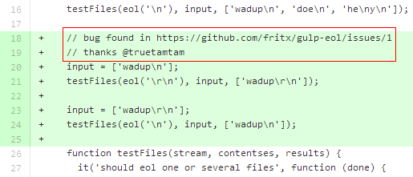

# gulp-eol bug修复之总结

*2014-09-06*

## 背景

[gulp-eol][1]是我之前写的一个gulp插件，主要用于统一文件的换行符。

今早打开github，发现一俄国人跑来我这开[issue][2]，说是复制/转移文件时，插件失效了，还贴出了他的gulpfile。


下午happy完回来，发现是自己程序的bug，修复后发布，并告知事主[@truetamtam][3]确认，tam很快说问题解决了，皆大欢喜。

## 我想说

凡事都应**以小见大**，这样才能进步成长。我列出了7点，不多。

### 1. 粗心大意

此bug乃低级错误：

```js
str = str.replace(/\r?\n/g, eol);
if (append && !(
  new RegExp(eol + '$').test(str))
  ) {
  // this statement should be always executed
  // but not remained here
  file.contents = new Buffer(str + eol);
}
```

我错将一个关键的赋值逻辑放入了`if(){}`中，加之测试覆盖不全，导致bug埋藏许久。

### 2. 心存感激

整个issue下来，共6次发言，我和tam各3次。我们的发言基本上都带有感谢或友好。虽然这大多时候只是一种礼节，但我相信大家都是一样，发自内心地享受友爱和互助。

我甚至在[代码更新][4]中“慷慨激昂”地道谢：



### 3. 明于展示

> Talk is cheap, show me the code!

相信大家都知道这句it界的名言，口说无凭，很多时候我们需要用代码、用实例来说明问题。在这一点上，我和tam都是做的不错的：

- 问题提出时，他贴上了gulpfile，便于我对环境的了解
- bug初步确定时，我给出了简短的源码注解（同1.），表达了自己的判断

### 4. 巧于引用


bug修复后，在提交描述中提及issue的编号，如"#1"，issue页会及时地追加一条标签。虽然这只是github一个简单的功能，但它发挥着关键作用：

- 通知：及时明确地展示提交描述
- 关联：精确链接到具体的代码改动
- 简明：就具体的代码改动，你已无需额外发言阐述

另外，我用了"for #1"，而不是"fix #1"。因为此bug与事主的实例并无绝对联系，当时只是初步判定，用"for"可以在引用issue的同时，不close掉它。

### 5. 堪称典范

> 整个issue下来，共6次发言，我和tam各3次

是的，加上3次操作，共9步，让我们来回顾一下：

1. tam：提出问题，贴出实例
1. 我：表示迟点回应，感谢
1. 我：（发现有bug，贴上bug标签）
1. 我：表示已有初步判定，贴出注解，预告更新，感谢
1. tam：酷，感谢
1. 我：（提交更新，引用issue）
1. 我：告知已发布，要求确认
1. tam：表示确认，感谢
1. tam：（关闭issue）


别看这区区小issue，它包括了扼要的表达、精准的操作，包括了：

1. 提出议题，描述问题
1. 初步回应
1. 问题分类确定
1. 症结确定和描述
1. 预告更新
1. 更新提交和描述
1. 更新告知，要求确认
1. 问题解决确认
1. 关闭议题

这简直就是issue的标杆、模板与典范。感谢tam的配合。

### 6. 猜想成立

之前接触grunt/gulp这批新兴的构建工具，见识了琳琅满目的插件，加之web开发者的冲劲有目共睹，有了以下猜想：

- 复制/编译/压缩/测试，还有什么gulp不能做？
- gulp能做很多，将存在不少未开发甚至未知的插件
- 发现并开发出来，有类似需求的人会主动来前来使用

短短几行代码，gulp-eol写好发布，未作任何推广，自己没用几次，几个月后竟有人“自投罗网”。事实证明，我的猜想是对的。


### 7. 关于github

在同学之中，[我在github](https://github.com/fritx)上的活跃度和“功绩”应属最佳。这得益于web开发者（尤其是web前端）一贯的开源氛围。

以前是我找老外，提issue，现在也逐渐变成了他们找我。非常享受跟他们一起交流学习。当然，与国人、同学也是一样。

github能给你以“虚荣”：

- “嘿，npm排行第2的aysnc库，我可是[top6/89][5]的贡献者。”
- “用过zepto？” “不但用过，还参与开发，[top68/151][6]。”

github虽不是全部，但也是一种角度。据我所知，不少it公司，包括我们公司，都非常重视应聘者的github。多点使用github，尽可能开采它的功能吧。Just for fun!

## 结语

想提升**吹牛技艺**的可以联系本人。

注意，全文并未提及“装B”二字。

[1]: https://github.com/fritx/gulp-eol
[2]: https://github.com/fritx/gulp-eol/issues/1
[3]: https://github.com/truetamtam
[4]: https://github.com/fritx/gulp-eol/commit/86018672a37cfaa49ebb7f7c20bf9136b0add43a
[5]: https://github.com/caolan/async/graphs/contributors
[6]: https://github.com/madrobby/zepto/graphs/contributors