# node.js技术交流会

*2015-08-19*

@林亮(fritz.lin)

[MarkPPT在线演示](index.html) | [原文地址](../../../../?2015/08/nodejs-talk/)

---

## 程序员，能干什么？

### 创造世界？

---

three.js 宇宙模型


https://github.com/fritx/threejs-galaxy

---

A First-Person 3D version of the classic game Asteroids for Desktop and Mobile browsers. Currently works with Chrome and Firefox only. Click the link below to Play

https://github.com/erichlof/AsteroidPatrol3D

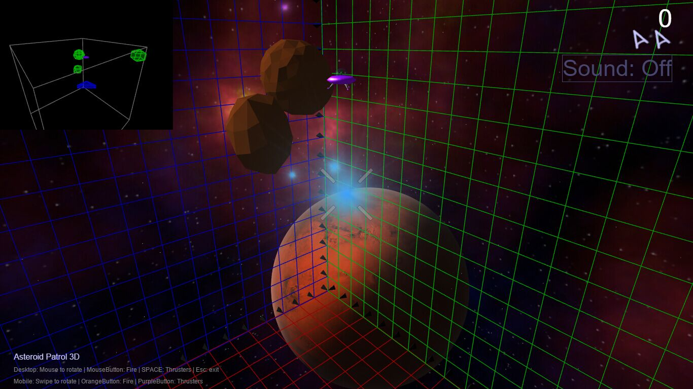

---

three.js 其他高大上的projects

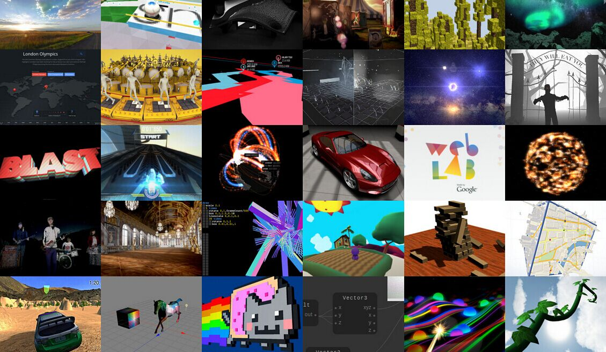

http://threejs.org/

---

不仅仅是一句“Hello World”

---

## JS，能干什么？

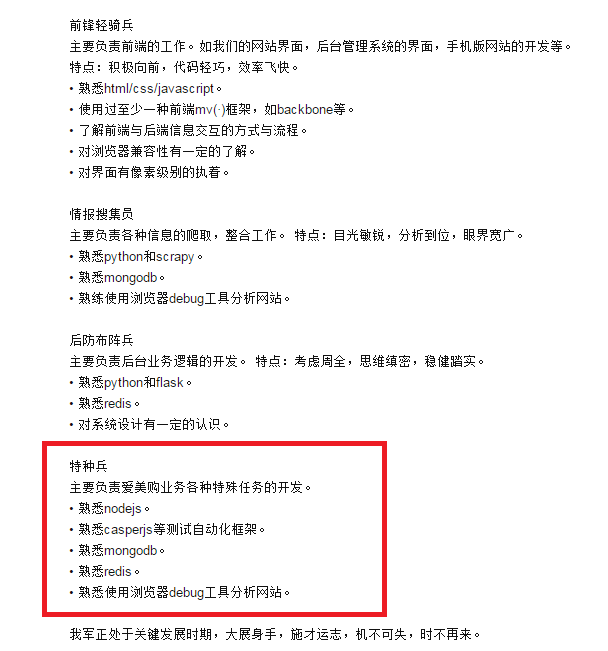

---

前端 / 后端 / 移动端 / 桌面端 / 命令行 / 系统工具

Windows / Linux / Mac(OSX)

---

### 答案是：

## 上天入地，无所不能


---

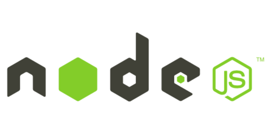

## 言归正传 node.js

---

## 单线程 不能利用多核CPU？

多进程 cluster

单线程也许更好

[多进程单线程模型与单进程多线程模型之争](https://cnodejs.org/topic/54b658faedf686411e1b9ef0)

---

## CPU密集型运算？

### 调用 C/C++ Addon

---

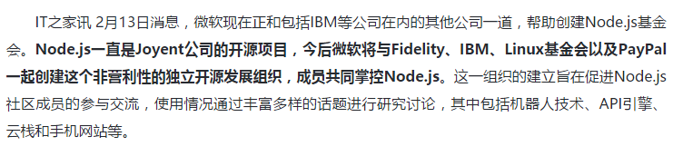

强强合作：微软、IBM等公司共建Node.js基金会

---

## node优势有哪些？

引擎快 非阻塞 事件驱动

高并发 高实时 数据密集

开发快 人才广 社区活跃

[Why The Hell Would I Use Node.js?](http://www.toptal.com/nodejs/why-the-hell-would-i-use-node-js)

---

头疼：node_modules嵌套太深 路径太长 @alen

恰恰反映了：依赖原子小 再小的库也是依赖

---

npm生态 零部件多

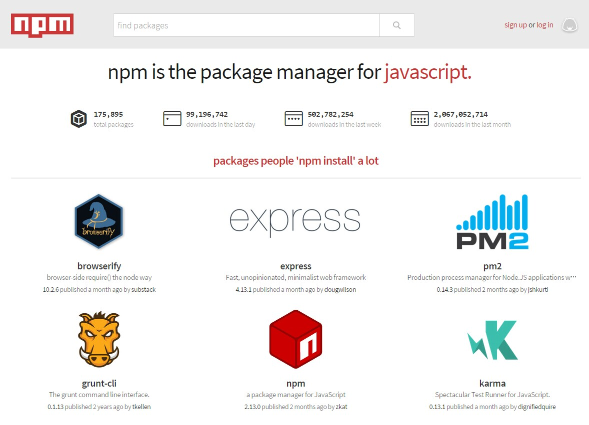

---

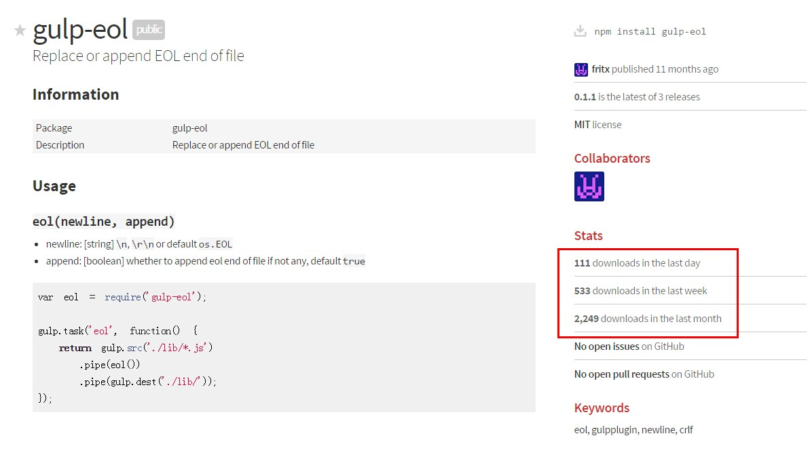

[gulp-eol bug修复之总结](http://blog.fritx.me/?2014/09/gulp-eol-bug)

---


---

### node关键词

## 创新 开源 激进 全栈

---

常用的库或工具

---

request http请求

```js
var request = require('request')

request.get('http://baidu.com', function(err, res, html){
  console.log(html)
})

request.post('http://example.com/login', {
  username: 'foo',
  password: 'bar'
}, function(err, res, html){
  console.log(html)
})
```

---

cheerio 网页解析

```js
var request = require('request')
var cheerio = require('cheerio')

request('http://baidu.com', function(err, res, html){
  var $ = cheerio.load(html)
  var title = $('title').text()
})
```

---

函数式 链式 声明式

lodash underscore

```js
var youngest = _.chain(users)
  .sortBy('age')
  .map(function(chr) {
    return chr.user + ' is ' + chr.age;
  })
  .first()
  .value();
```

highland 流式

```js
_('click', $('#cats-btn'))  
  .throttle(500)    // can be fired once in every 500ms 
  .pipe(getDataFromServer)
  .map(formatCats)
  .pipe(UI.render);
```

[Functional Reactive Programming with the Power of Node.js Streams](https://blog.risingstack.com/functional-reactive-programming-with-the-power-of-nodejs-streams/)

---

回调地狱

```js
$login.off('submit').on('submit', function(ev) {
  ev.preventDefault();
  // ...

  client.get('/', {}, {}, function() {
    client.get('/createsession_a.asp', {}, {}, function() {
      client.get('/createsession_b.asp', {}, {}, function() {
        client.get('/rndnum.asp', {}, {}, function() {
          client.cookie['LogonNumber'] = '';
          client.post('/logon.asp', data, {
            'Referer': 'http://jwc.wyu.edu.cn/student/body.htm'
          }, function(err, res, body){
            var success = /welcome/.test(body);
            // ...
          });
        });
      });
    });
  });
});
```

---

async 流程控制 同/异步

```js
async.eachSeries(songs, function savevoice(song, next){ // 逐个下载
  next = _.wrap(next, function(next, err){ // hack next
    if (err) {
      // on error
    } else {
      // on success
    }
    _.delay(function(){
      next(null) // 忽略err继续
    }, 3000) // 等待3秒继续
  })
  pub.getvoicedata(song.msgid, function(err, buf){
    if (err) return next(err)
    fs.writeFile(config.mediadir + '/' + song.localfile, buf, function(err){
      if (err) return next(err)
      clearsong(song)
      dbsongs.push(song)
      db.save()
      next(null)
    })
  })
}, function(){
  // on complete
})
```

---

ES6 ES7 新语法 新特性 展望

https://github.com/lukehoban/es6features

https://github.com/hemanth/es7-features

---

express WebServer RESTFul-API middlewares

https://github.com/fritx/channel/blob/dev/src%2Fserver%2Fapi.js

```js
var app = express()

app.use('/api', bodyParser.urlencoded({ extended: false }))
app.use('/api', multer({ limits: bytes('4mb') }))

app.post('/api/channels/:key/comments', function (req, res, next) {
  // ...
  db.save()
  res.send({ floor: comment.floor })
})

app.post('/api/channels', function (req, res) {
  // ...
  db.save()
  res.send({ key: channel.key })
})
```

---

socket.io 即时通讯 事件驱动

https://github.com/socketio/socket.io/blob/master/examples%2Fchat%2Findex.js

```js
var io = require('socket.io')(server)

io.on('connection', function (socket) {
  // ...
  // when the client emits 'new message', this listens and executes
  socket.on('new message', function (data) {
    // we tell the client to execute 'new message'
    socket.broadcast.emit('new message', {
      username: socket.username,
      message: data
    });
  });

  // when the client emits 'typing', we broadcast it to others
  socket.on('typing', function () {
    socket.broadcast.emit('typing', {
      username: socket.username
    });
  });

  // when the client emits 'stop typing', we broadcast it to others
  socket.on('stop typing', function () {
    socket.broadcast.emit('stop typing', {
      username: socket.username
    });
  });

  // when the user disconnects.. perform this
  socket.on('disconnect', function () {
    // ...
    // echo globally that this client has left
    socket.broadcast.emit('user left', {
      username: socket.username,
      numUsers: numUsers
    });
  });
});
```

---

自动化测试 mocha assert

```js
var assert = require('assert')
var bufferEqual = require('buffer-equal')
var fa = require('../')

describe('fs-auth', function(){
  var originalStr = 'hello啊 world 你是大傻逼123 ahah'
  var originalBuf = new Buffer(originalStr)
  var pwd = 'n0gx'
  var encryptedBuf

  it('locks with pwd', function(){
    encryptedBuf = fa.lock(originalBuf, pwd)
    assert(!bufferEqual(encryptedBuf, originalBuf))
  })

  it('auths with pwd', function(){
    var _originalBuf = fa.auth(encryptedBuf, pwd)
    assert(bufferEqual(_originalBuf, originalBuf))
  })

  it('auths fail with incorrect pwd', function(){
    assert.throws(function(){
      fa.auth(encryptedBuf, 'bad')
    }, 'auth fail')
  })
})
```

---

请求返回 验证

```js
  it('redirects', function(done){
    request({
      method: 'POST',
      url: 'https://shenghuo.alipay.com/send/payment/fill.htm',
      form: formData
    }, function(e, res, html){
      assert.equal(e, null)
      assert.equal(res.statusCode, 200)
      pageHtml = html
      done()
    })
  })

  it('fills form', function(done){
    var $ = cheerio.load(pageHtml)
    $form = $('form.needIframe')
    assert($form.length, 1)

    assert.equal(
      $form.find('[name=optEmail]').val(),
      formData['optEmail']
    )
    assert.equal(
      $form.find('[name=payAmount]').val(),
      // toFixed(2) to compare with field value
      Number(formData['payAmount']).toFixed(2)
    )
    assert.equal(
      $form.find('[name=title]').val(),
      formData['title']
    )
    assert.equal(
      $form.find('[name=memo]').val(),
      formData['memo']
    )
    done()
  })
```

---

浏览器运行 验证 phantomjs nightmare

```js
new Nightmare({ weak: false })
  .goto('about:blank')
  .wait()
  .inject('js', f('../includes/jquery-2.1.3.min.js'))
  .inject('js', f('../quick-pay.js'))
  .evaluate(new Function(
    'window.payData='+ JSON.stringify(payData)
  ))
  .evaluate(function(){
    var $btn = $('<button class="donate">Donate!</button>')
    $btn.on('click', function(){
      quickPay(payData)
    }).appendTo('body')
  })
  .click('.donate')
  .wait()
  .url(function(url){
    // test url
    assert.equal(url, 'https://shenghuo.alipay.com/send/payment/fill.htm')
  })
  // ...
```

---

```js
  // ...
  .inject('js', f('../includes/jquery-2.1.3.min.js'))
  .evaluate(function(){
    var $form = $('form.needIframe')
    return {
      array: $form.serializeArray()
    }
  }, function(ret){
    var fields = _.reduce(ret.array, function(memo, item){
      memo[item.name] = item.value
      return memo
    }, {})
    // test form fields
    assert.equal(
      fields['optEmail'], payData['to']
    )
    assert.equal(
      fields['payAmount'],
      // toFixed(2) to compare with field value
      Number(payData['amount']).toFixed(2)
    )
    assert.equal(
      fields['title'], payData['title']
    )
    assert.equal(
      fields['memo'], payData['body']
    )
  })
  .run(function(e){
    console.log(e)
    done()
  })
```

---

构建工具 gulp grunt

集成自动化 保证代码质量 提高开发效率

[emshop/gulpfile](https://github.com/fritx/emshop/blob/master/gulpfile.coffee) vs [mshop/Gruntfile](https://github.com/fritx/mshop/blob/master/Gruntfile.js)

---

PM2 进程管理

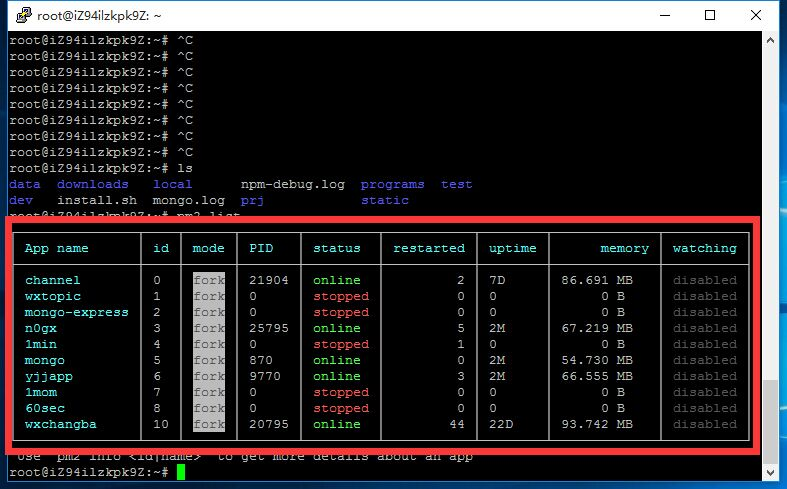

---

桌面客户端 站在巨人的肩膀上 nodejs+chrome

一次编码 处处运行

electron(atom-shell) nw.js(node-webkit)

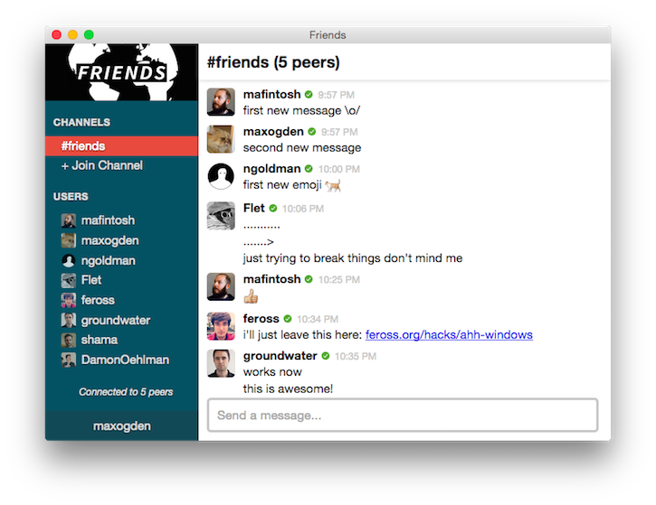

---

### 小工具 随便玩玩

---

### fanyi

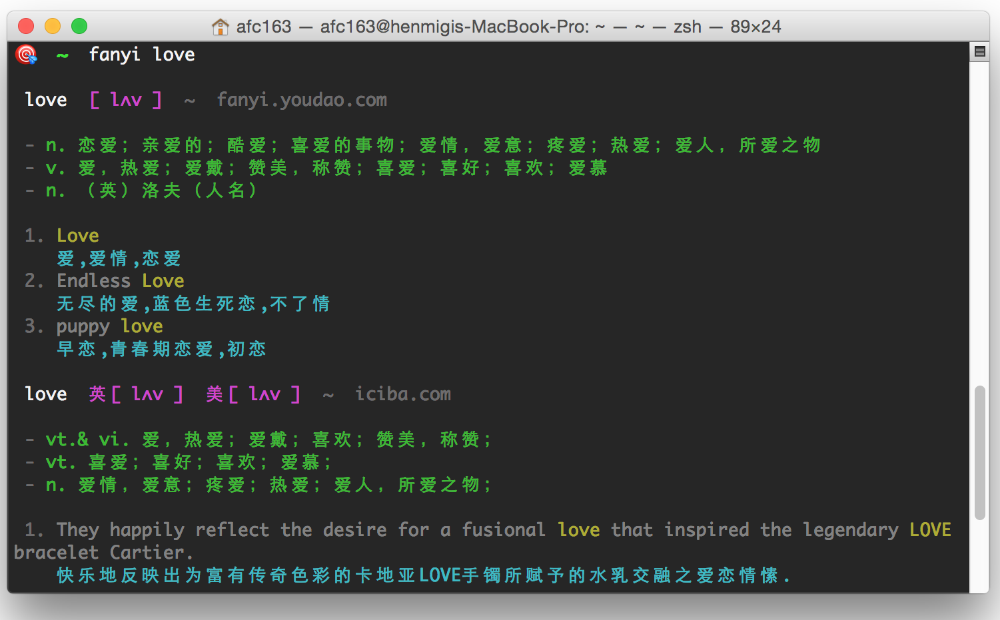

https://github.com/afc163/fanyi

---

### qqlog

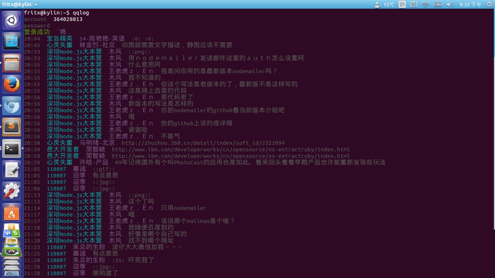

https://github.com/fritx/qqlog

---

### gulp-app

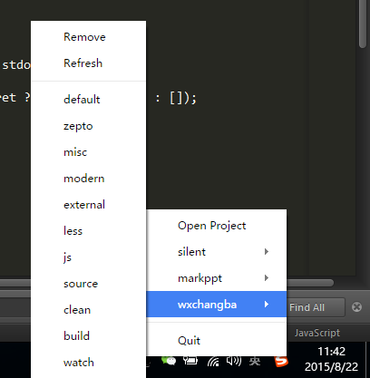

https://github.com/fritx/gulp-app

---

### markppt

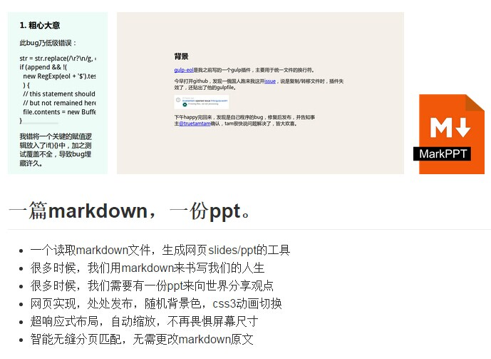

https://github.com/fritx/markppt

---

Talk is cheap. show me the code.

## Code Time!

---

抓取网页 wet @near

字符集探测/转换 phantomjs加载分析

https://github.com/fritx/wet

---

命令行 进程调度 PUM

命令解析 进程树 windows兼容 开机自启动

https://github.com/fritx/PUM

---

微信唱吧 wxchangba

微信认证API 微信公众平台抓取 gulp构建 lowdb存储

https://github.com/fritx/wxchangba

---

Music @alen

基于electron 开发桌面客户端


https://github.com/Alen-gao/Music

---

Genius-Talk 技术细节 @near

---
